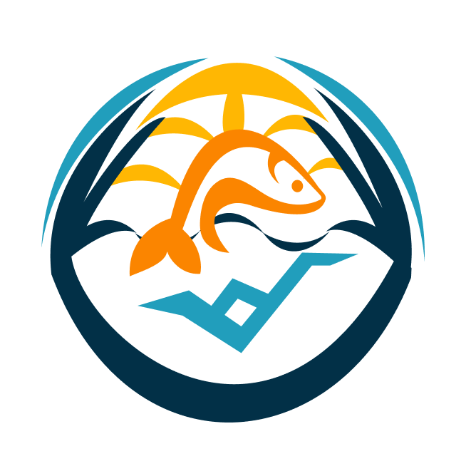
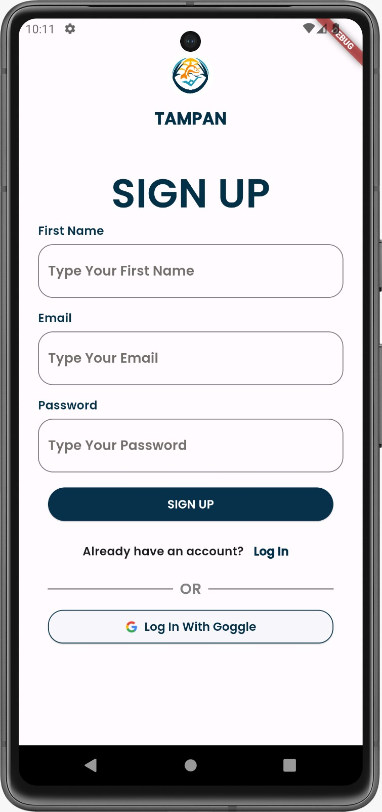

# 
TAMPAN (TAMbak Petani ANdalan)

Tambak Petani Andalan adalah aplikasi yang yang dirancang untuk para petani tambak dalam mengelola usaha tambak. Aplikasi ini menyediakan beberapa fitur pendukung untuk mengoptimalkan hasil produksi ikan dan mengurangi risiko kerugian usaha. Berikut adalah fitur-fitur yang dapat digunakan pada aplikasi TAMPAN:

## 
1.  Buku Keuangan (Financial Ledger)

Menawarkan fitur-fitur untuk manajemen keuangan seperti pencatatan pemasukan dan pengeluaran anggaran usaha.

## 
2.  Analisis Bisnis (Business Analysis)

Membantu dalam melakukan analisis dan visualisasi data terkait dengan proses akuakultur, metrik produksi, dan kinerja keuangan.

## 
3.  Klasifikasi Penyakit Ikan (Fish Disease Classification)

Memanfaatkan model machine learning melakukan klasifikasi penyakit ikan dengan 3 kategori: sehat, sakit disebabkan bakteri, dan sakit disebabkan jamur.

## 
4.  Jadwal Siklus (Cycle Schedule)

Melakukan integrasi dengan platform kalender sehingga memungkinkan untuk mengelola siklus akuakultur

#######

# 
Progres Tim Hacker

Stage 2:

- Melakukan perancangan dasar
- Membuat halaman login akun, halaman untuk registrasi akun (register)

  
   

- Membuat prototipe halaman untuk klasifikasi penyakit ikan

#######

### 
Terima Kasih

> BismillahDirestuiBapak 2.0
